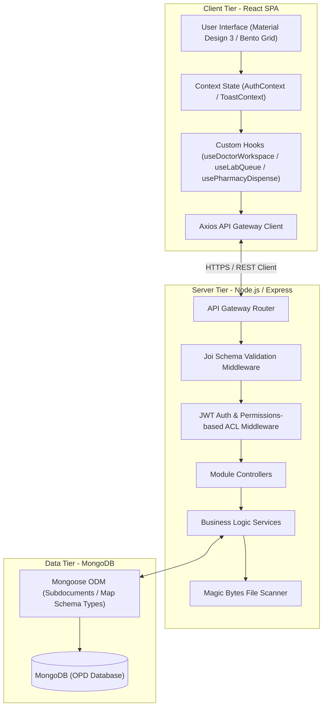
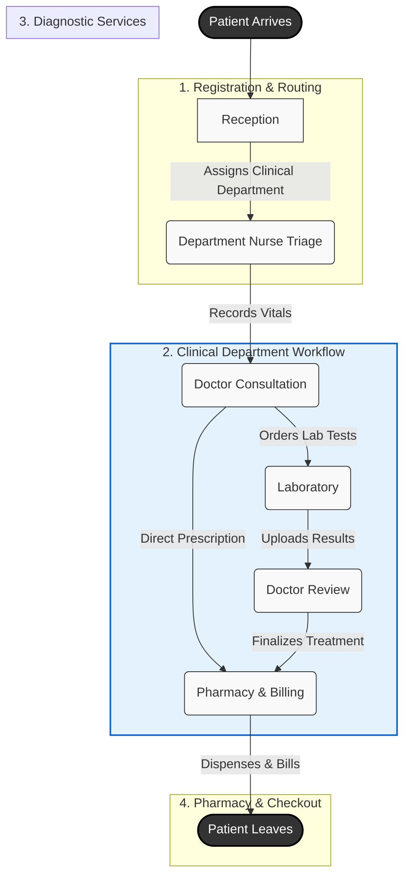

# Hospital Management System (HMS) - OPD Module

A comprehensive, role-based Hospital Management System focused on Outpatient Department (OPD) workflows. The system provides a seamless, state-driven lifecycle for patients, ensuring efficient routing between hospital departments from registration to billing.

---

## 🏗️ System Architecture

The application is built on a modern **MERN stack** (MongoDB, Express, React, Node.js) with a heavily decoupled, service-oriented backend architecture and a highly polished, responsive Material Design 3 frontend client.



### Core Architecture Layers

#### 1. Client Tier (Frontend React Client)
*   **Design Tokens (Material Design 3)**: Driven by standard color tokens (`var(--md-sys-color-*)`), standard spacing (`var(--md-spacing-*)`), and shape variables to achieve an elegant, modern dark/light mode visual system.
*   **Layout Patterns (Bento Grid & CSS Cascading Grid)**: Implements responsive, non-overlapping Bento Grid dashboards. Fully eliminates layout stutter and `!important` CSS rules.
*   **Custom React Hooks**: Encapsulates component business logic (e.g., [`useDoctorWorkspace`](file:///frontend/src/hooks/useDoctorWorkspace.js), [`useLabQueue`](file:///frontend/src/hooks/useLabQueue.js)) to keep views focused strictly on rendering.

#### 2. Server Tier (Express Backend)
*   **Permissions-based ACL**: Mid-tier middleware (`requirePermission`) enforces authorization at the endpoint level based on granular permissions (e.g., `LAB_PROCESS`, `MEDICINE_DISPENSE`) rather than simple role checks.
*   **ACID MongoDB Transactions**: Multi-document operations (such as finalizing visits or staff position promotions) are wrapped in Mongoose transactions (`withTransaction`), ensuring complete execution or rollback.
*   **Magic Bytes File Interceptor**: Inspects uploaded radiology scans or PDF reports on the server using magic signature verification to prevent file header spoofing.

#### 3. Data Tier (MDB Database)
*   **Mongoose Subdocuments**: Embedded structures like `labOrders` are managed as subdocument arrays inside the `Visit` schema, enabling cohesive reads/writes.
*   **Mongoose Map Types**: Flexible diagnostic results are stored using the Mongoose `Map` schema type, preserving key-value pairs representing custom test metrics.

---

## 👥 Roles and Responsibilities

The system is strictly governed by Role-Based Access Control (RBAC). Each role has a specific, isolated dashboard and tailored permissions.

| Role | Purpose & Capabilities |
| :--- | :--- |
| **Receptionist** | Registers new patients, updates demographics, creates new OPD visits, assigns patients to clinical departments, and handles basic front-desk billing. |
| **Nurse** | Deployed within specific clinical departments (e.g., General Medicine). Records department-specific vital signs (triage) and initiates initial patient records. |
| **Doctor** | Reviews history/vitals, records clinical notes/diagnosis, orders laboratory tests, reviews completed lab results, and finalizes prescriptions. |
| **Lab Technician** | Receives lab orders, logs specimen collection, inputs results into dynamic parameters, and uploads scanned reports. |
| **Pharmacy** | Manages dispensary, overrides medicine quantities, prints billing invoices, collects patient payments, and closes visits. |
| **Administrator** | Configures department dynamic vitals, manages staff career progression hierarchies, and modifies lab test catalogs. |

---

## 🔄 Patient Lifecycle (OPD Workflow)

The system tracks the patient's `Visit` status through a strict state machine, automatically routing the patient to their next destination.



---

## 💻 Module Workspace Deep-Dive

### 1. Reception Desk
*   **Working & Logic**: The receptionist handles patient check-in. They can register a new patient or lookup existing records via full-text search. On check-in, the receptionist assigns the patient to an active clinical department (e.g., General Medicine).
*   **Layout Capabilities**:
    *   Responsive bento cards for patient demographic forms.
    *   Automatic token serial generation (`GEN-001`) with live queue metrics.
    *   Triage queue dispatching system.

### 2. Nurse Triage Desk
*   **Working & Logic**: Nurses pull patients from their department's localized waiting list. They perform triage, record vitals, and write the chief complaint. Vitals inputs are dynamically loaded based on the selected clinical department (e.g., Cardiology displays Blood Pressure and Pulse, while Pediatrics might require height and weight percentiles).
*   **Layout Capabilities**:
    *   Color-coded vitals input grids displaying normal ranges.
    *   Queue control bar (Call Patient, Skip Patient, Requeue).
    *   Validation states highlighting abnormal vitals (e.g., high blood pressure) instantly.

### 3. Doctor Portal (MD3 Clinical Workstation)
*   **Working & Logic**: The doctor selects patients from a tiered queue (In-Progress, Awaiting Review). The workstation uses a split-pane layout with a Patient Header containing allergy and triage summaries, and a 4-tab clinical editor:
    *   **Summary**: A read-only overview of vitals, history, and active complaints.
    *   **Consultation**: Text areas for HPI, Physical Exam, and Diagnosis, plus an inline horizontal Prescription Manager to append medications.
    *   **Orders & Results**: A Lab Orders selector to request tests and a Lab Results viewer displaying reported laboratory values.
    *   **History**: A timeline of the patient's historical visits.
*   **Layout Capabilities**:
    *   Inline prescription manager with autocomplete search for medicines, dosage rules, and duration.
    *   Visual indicators for completed lab test results ready for review.
    *   Draft autosave function to prevent data loss.

### 4. Laboratory Workstation
*   **Working & Logic**: Technicians process ordered tests in two stages:
    1.  **Specimen Collection**: Technician draws the sample and clicks "Collect Sample", moving the order state to `PROCESSING`.
    2.  **Result Reporting**: The technician inputs test metrics into dynamic form fields (Hematology/Biochemistry fields) or uploads scanned reports (PDFs/X-Rays).
*   **Layout Capabilities**:
    *   MD3 dynamic confirmation dialogs replacing native browser alerts.
    *   Recent reported results log (retains completed patients for 24 hours to export result sheets).
    *   Safe drag-and-drop file uploader with server-side signature validation.

### 5. Pharmacy & Billing Desk
*   **Working & Logic**: Pharmacists dispense medication and handle billing. The system pulls the visit profile, displays ordered medicines, automatically calculates costs, and allows overriding quantities or custom prices.
*   **Layout Capabilities**:
    *   Dispensing checklists with medication instructions.
    *   Real-time aggregated billing overview (Medications + Consultation Fees + Lab Charges).
    *   Print-friendly invoices and checkout completion button.

---

## ⚙️ Development Setup & Configuration

Follow these steps to deploy and run the MERN system locally on your development workstation.

### 1. Prerequisites
- **Node.js**: v18.0.0 or higher
- **MongoDB**: Local Community Server (v6.0+) running on port `27017` or a remote MongoDB Atlas cluster URI.

### 2. Environment Variables Configuration
The backend reads environment configuration files from the `/secrets` folder in the project root. Create a file at `secrets/backend.env` with the following variables:

```env
PORT=5000
MONGO_URI=mongodb://localhost:27017/hms_opd
JWT_SECRET=your_super_secret_jwt_access_key_here
JWT_REFRESH_SECRET=your_super_secret_jwt_refresh_key_here
JWT_EXPIRY=15m
JWT_REFRESH_EXPIRY=7d
ENCRYPTION_KEY=64_character_hexadecimal_symmetric_key_here
BCRYPT_ROUNDS=10
```

> [!NOTE]
> Make sure `ENCRYPTION_KEY` is a valid 32-byte hexadecimal string (64 characters) to support Patient demographics encryption.

---

## 🛠️ Installation & Dependency Resolution

Run the following commands in your terminal starting from the root of the project repository.

### 1. Backend Setup
```bash
cd backend
npm install
```

### 2. Frontend Setup
```bash
cd ../frontend
npm install
```

---

## 🔋 Initial Database Seeding

To bootstrap the database with complete mock data representing patients in all lifecycle stages, run the consolidated complete seeding script:

```bash
cd backend
node scripts/seed-complete-hms.js
```

Upon success, this will seed:
*   **5 Departments**: ADM, GEN, CAR, LAB, PHM.
*   **9 Staff Accounts**: admin, reception, doctor, cardio_doc, nurse, cardio_nurse, labtech, lab_director, pharmacy (Password for all: `Password123!`).
*   **2 Diagnostic Test Catalogs**: Complete Blood Count (CBC) & Lipid Profile (LPD).
*   **8 Patients & Visit Profiles**: pre-routed to Triage, Doctor, Laboratory, and Pharmacy queues.

---

## 🚀 Running the Application (OS-Specific Commands)

### 💻 Windows (PowerShell / Command Prompt)

To launch the project on Windows, open two separate shell instances:

**Terminal 1 (Backend Node server):**
```powershell
cd backend
npm run dev
```

**Terminal 2 (Frontend Vite client):**
```powershell
cd frontend
npm run dev
```

---

### 🍎 macOS (Terminal)

Open two terminal windows or tmux panes:

**Terminal 1 (Backend Node server):**
```bash
cd backend
npm run dev
```

**Terminal 2 (Frontend Vite client):**
```bash
cd frontend
npm run dev
```

---

### 🐧 Linux (Bash)

**Terminal 1 (Backend Node server):**
```bash
cls
cd backend
npm run dev
```

**Terminal 2 (Frontend Vite client):**
```bash
cls
cd frontend
npm run dev
```

*Frontend client launches locally at:* `http://localhost:5173/`  
*Backend API gateway runs locally at:* `http://localhost:5000/api/v1/`
